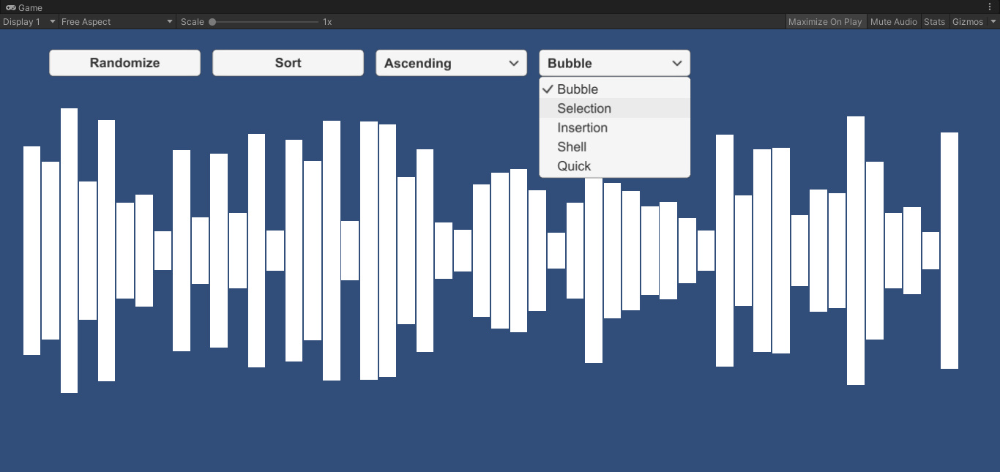
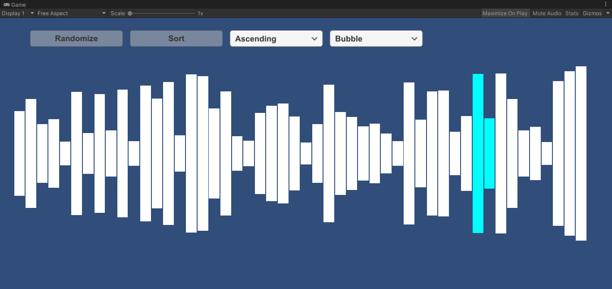
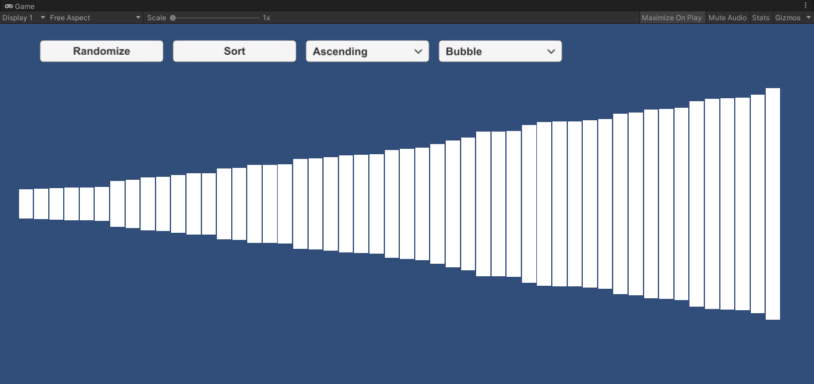
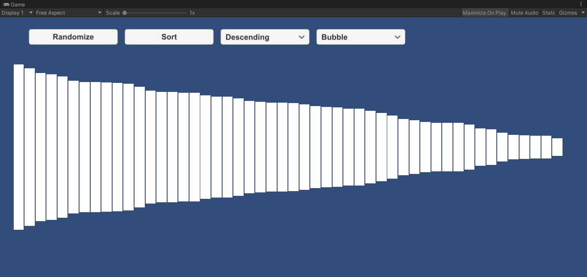

# 🔢 Sort Algorithms Visualizer (Unity)

A Unity project that visualizes five popular sorting algorithms in an interactive and educational way.  
It's designed to help understand how sorting works step-by-step through animated bars and visual feedback.

## 🧠 Implemented Algorithms

- 🫧 **Bubble Sort**
- 📍 **Selection Sort**
- 🔑 **Insertion Sort**
- 🪜 **Merge Sort**
- ⚡ **Quick Sort**

## 🚀 Getting Started

To run the project locally:

1. Clone the repository:
   ```bash
   git clone https://github.com/Pixel0Void/SortAlgorithms.git
   ```
2. Open the project with Unity (tested on version `2019.4.10f1`)
3. Press Play in the Editor to see the visualizer in action!

## 📸 Screenshots

### Algorithms


### Sorting


### Ascending


### Descending


## 📜 License

This project is open-source and free.
Feel free to modify or build upon it!

---

Made with ❤️ by [Pixel0Void](https://github.com/Pixel0Void)
